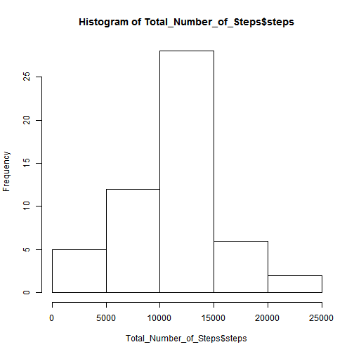
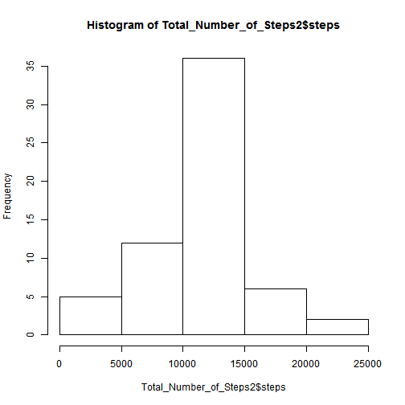
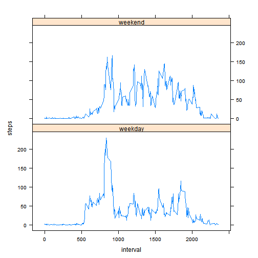

## Reproducible Research : Peer Assessment 1

### Loading and preprocessing the data

* Load the data

### *Code for reading in the dataset and processing the data:*


```r
activity = read.csv("activity.csv")
```
 
* Process/ transform the data into a format suitable for the analysis


```r
Total_Number_of_Steps <- aggregate(steps ~ date, data = activity, sum, na.rm = TRUE)
```

### What is mean total number of steps taken per day?

* Make a histogram of the total number of steps taken each day (ignoring the missing values in the dataset)

### *A histogram of the total number of steps taken each day:*


```r
hist(Total_Number_of_Steps$steps)
```

 

* Calculate and report the mean and median total number of steps taken per day

### *Both the mean and median number of steps taken each day reported:*


```r
round(mean(Total_Number_of_Steps$steps), digits=0)
```

```
## [1] 10766
```


```r
median(Total_Number_of_Steps$steps)
```

```
## [1] 10765
```

### What is the average daily activity pattern?


* Make a time series plot (i.e. type = "l") of the 5-minute interval (x-axis) and the average number of steps taken, averaged across all days (y-axis)

### *A time series plot of the average number of steps taken (averaged across all days) versus the 5-minute intervals:*


```r
interval_of_steps <- aggregate(steps ~ interval, data = activity, mean, na.rm = TRUE)
plot(steps ~ interval, data = interval_of_steps, type = "l")
```

 

### *The 5-minute interval that, on average, contains the maximum number of steps:*


```r
interval_of_steps[which.max(interval_of_steps$steps), ]$interval
```

```
## [1] 835
```
### Imputing missing values
* Calculate and report the total number of missing values in the dataset (i.e. the total number of rows with NAs)


```r
sum(is.na(activity$steps))
```

```
## [1] 2304
```

### *Describe and show with code a strategy for imputing missing data:*

The strategy was to input the mean for all the missing (NA) values after creating a function (below) to calculate the mean number of steps for 5-minute intervals.


```r
interval2steps <- function(interval) {
    interval_of_steps[interval_of_steps$interval == interval, ]$steps
}
```

* Create a new dataset that is equal to the original dataset but with the missing data filled in.


```r
activity_inputed <- activity  # Make a new dataset with the original data
count = 0  # Count the number of data filled in
for (i in 1:nrow(activity_inputed)) {
    if (is.na(activity_inputed[i, ]$steps)) {
        activity_inputed[i, ]$steps <- interval2steps(activity_inputed[i, ]$interval)
        count = count + 1
    }
}
cat("Total ", count, "NA values were filled.\n\r")
```

```
## Total  2304 NA values were filled.
## 
```

### *A histogram of the total number of steps taken each day after missing values were imputed:*


```r
Total_Number_of_Steps2 <- aggregate(steps ~ date, data = activity_inputed, sum)
hist(Total_Number_of_Steps2$steps)
```

 

The mean total number of steps taken per day:


```r
round(mean(Total_Number_of_Steps2$steps), digits=0)
```

```
## [1] 10766
```

The median total number of steps taken per day:


```r
round(median(Total_Number_of_Steps2$steps), digits=0)
```

```
## [1] 10766
```

Do these values differ from the estimates from the first part of the assignment? What is the impact of imputing missing data on the estimates of the total daily number of steps?

The mean value is equivalent to the previous value before imputing missing data since the mean value was used for those 5-minute intervals.
The median value exhibits a slight difference but this depends on its location.


### Are there differences in activity patterns between weekdays and weekends?

* Create a new factor variable in the dataset with two levels - "weekday" and "weekend" - indicating whether a given date is a weekday or weekend day.

### *A panel plot comparing the average number of steps taken per 5-minute interval across weekdays and weekends:*


```r
activity_inputed$day = ifelse(as.POSIXlt(as.Date(activity_inputed$date))$wday%%6 == 
    0, "weekend", "weekday")
# For Sunday and Saturday : weekend, Other days : weekday
activity_inputed$day = factor(activity_inputed$day, levels = c("weekday", "weekend"))
```

* Make a panel plot containing a time series plot (i.e. type = "l") of the 5-minute interval (x-axis) and the average number of steps taken, averaged across all weekday days or weekend days (y-axis).


```r
interval_of_steps2 = aggregate(steps ~ interval + day, activity_inputed, mean)
library(lattice)
xyplot(steps ~ interval | factor(day), data = interval_of_steps2, 
aspect = 1/2, 
type = "l")       
```

 
